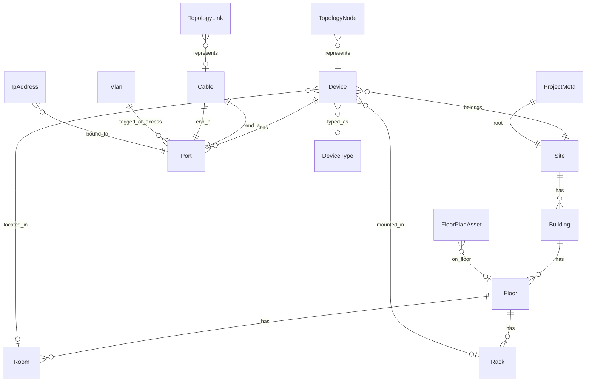

# LanDesigner — план разработки

## Решения по продукту

| Параметр | Выбор | Обоснование |
|----------|--------|-------------|
| Фокус MVP | **LAN CAD + CMDB lite** | Схема топологии/планов + карточки оборудования, порты, кабели, VLAN/IP |
| Формат | **Гибрид** | Сейчас локальный десктоп; позже — общий репозиторий без переписывания домена |
| Стек UI | **PySide6 (Qt)** | Canvas для схем, карточки, таблицы, печать |
| Хранение MVP | **SQLite-файл `.lanproj`** | Офлайн, один инженер / один ПК |
| Хранение later | **Общий репозиторий** (API + серверная БД) | Через абстракцию `ProjectRepository` |
| Граф схемы | **QGraphicsScene / View** | Узлы, связи, зум, слои, планы этажей |

---

## Цель продукта

Десктоп-приложение инженера ЛВС в духе **LAN CAD + CMDB lite**:

- **CAD:** визуальная топология и размещение на плане этажа.
- **CMDB lite:** карточка устройства (идентификация, расположение, порты, кабели, VLAN/IP), поиск и отчёты.

Локально проект живёт в файле `.lanproj`. Архитектура заранее отделяет домен и UI от способа хранения, чтобы позже подключить общий репозиторий (общий каталог / сервер) без смены модели сущностей.

---

## Архитектура (гибрид)

```mermaid
flowchart TB
  subgraph ui [UI_PySide6]
    MainWindow
    TopologyView
    FloorPlanView
    DeviceCard
    InventoryTables
    PropertyPanel
    ReportsView
  end

  subgraph app [Application]
    ProjectService
    TopologyService
    InventoryService
    ValidationService
    ImportExportService
    ReportService
  end

  subgraph ports [Repository_ports]
    ProjectRepository
  end

  subgraph adapters [Adapters]
    LocalSqliteRepo["LocalSqliteRepository"]
    FutureRemoteRepo["RemoteRepository_later"]
  end

  subgraph storage [Storage]
    SQLiteFile["SQLite_.lanproj"]
    RemoteAPI["HTTP_API_later"]
  end

  MainWindow --> ProjectService
  TopologyView --> TopologyService
  FloorPlanView --> TopologyService
  DeviceCard --> InventoryService
  InventoryTables --> InventoryService
  PropertyPanel --> InventoryService
  ReportsView --> ReportService

  ProjectService --> ProjectRepository
  TopologyService --> ProjectRepository
  InventoryService --> ProjectRepository
  ValidationService --> ProjectRepository
  ImportExportService --> ProjectRepository
  ReportService --> ProjectRepository

  ProjectRepository <-- LocalSqliteRepo
  ProjectRepository <-- FutureRemoteRepo
  LocalSqliteRepo --> SQLiteFile
  FutureRemoteRepo --> RemoteAPI
```

### Слои

1. **UI** — схема, план, карточка устройства, таблицы; без SQL и без знания «файл или сервер».
2. **Application services** — сценарии: открыть проект, создать устройство, соединить порты, валидация, отчёты.
3. **Domain** — сущности, UUID, инварианты, события изменений (для будущего sync).
4. **Repository port** — интерфейс `ProjectRepository` (load/save/query/unit-of-work).
5. **Adapters** — `LocalSqliteRepository` (MVP); позже `RemoteRepository` + кэш/offline.

### Задел под общий репозиторий (обязателен уже в MVP)

| Практика | Зачем |
|----------|--------|
| UUID у всех сущностей (`id: UUID`) | Слияние и sync без конфликтов автоинкрементов |
| `updated_at` / `revision` на корневых сущностях | Обнаружение конфликтов при sync |
| Интерфейс `ProjectRepository` | Смена backend без переписывания сервисов |
| Метаданные проекта (`project_meta`: name, schema_version, origin) | Привязка локальной копии к remote id позже |
| Доменные операции через Unit of Work | Пакетные commit’ы = будущие sync-батчи |
| Без прямой зависимости UI → SQLAlchemy session | Иначе remote-адаптер не влезет |

**MVP:** один `ProjectRepository` + UoW с методами по агрегатам (`Device`, `Cable`, …). Дробить на отдельные repo-классы и CQRS lite для отчётов — только если интерфейс раздуется; для простых отчётов достаточно query-методов в том же адаптере.

**Не делаем в MVP:** сервер, auth, realtime-коллаборация, автоматический merge UI, in-memory кэш валидации, импорт из NetBox/1С (только свой CSV).  
**Делаем в этапе «репозиторий later»:** API, учётные записи, push/pull или «открыть с сервера», блокировка редактирования, разрешение конфликтов.

### Структура репозитория (целевая)

```
LanDesigner/
  PLAN.md
  README.md
  pyproject.toml
  main.py
  landesigner/
    __init__.py
    app.py
    domain/
      enums.py
      entities.py          # dataclasses / модели домена
      validators.py
    ports/
      repository.py        # Protocol: ProjectRepository
    adapters/
      local_sqlite/
        models.py          # SQLAlchemy
        repository.py
        session.py
        migrations/
      # remote/             # позже
    services/
      project.py
      inventory.py
      topology.py
      validation.py
      import_export.py
      reports.py
    ui/
      main_window.py
      views/
        topology_view.py
        floor_plan_view.py
        inventory_view.py
        device_card_view.py
        reports_view.py
      widgets/
        property_panel.py
        port_matrix.py
      dialogs/
        device_dialog.py
        cable_dialog.py
        site_dialog.py
    resources/
      icons/
      templates/
  tests/
```

---

## Модель данных

Единая модель для CAD и CMDB: схема ссылается на те же `Device` / `Cable`, что и карточки.



### Enum’ы (фиксируем в первой миграции)

| Enum | Значения | Где |
|------|----------|-----|
| `PortStatus` | `FREE`, `OCCUPIED`, `RESERVED`, `DISABLED` | `Port.status` |
| `PortMedia` | `COPPER`, `FIBER`, `DAC`, `VIRTUAL` | `Port.media` |
| `CableKind` | `COPPER`, `FIBER`, `DAC` | `Cable.kind` |
| `CableCategory` | например `CAT5E`, `CAT6`, `CAT6A`, `OM3`, `OM4`, `OS2`, `OTHER` | `Cable.category` |
| `DeviceRole` | `SWITCH`, `ROUTER`, `AP`, `SERVER`, `WORKSTATION`, `PATCH_PANEL`, `OTHER` | `Device.role` / `DeviceType.role` |

`OCCUPIED` выставляется при наличии активного конца кабеля; ручной `RESERVED` / `DISABLED` — из карточки.

### Сущности (MVP)

| Сущность | Роль в CAD / CMDB | Ключевые поля |
|----------|-------------------|---------------|
| `ProjectMeta` | Корень файла / будущий remote project | uuid, name, schema_version, origin |
| `Site` | Площадка | name, address, notes |
| `Building`, `Floor`, `Room` | Иерархия + подложка плана | name, level, plan_image_relpath, scale_m_per_px |
| `Rack` | Расположение в CMDB | name, units, unit placement |
| `DeviceType` | Шаблон для быстрых карточек | vendor, model, role, `port_template` JSON |
| `Device` | **Карточка оборудования** | hostname, serial, inventory_tag, role, location FKs |
| `Port` | Порты в карточке + концы связей | name, speed, `media: PortMedia`, `status: PortStatus` |
| `Cable` | Физика + линия на схеме | label, `kind: CableKind`, `category: CableCategory`, length_m, ends |
| `Vlan`, `IpAddress` | Сетевые атрибуты CMDB | vlan_id, cidr, gateway |
| `TopologyNode` / `TopologyLink` | **Схема** | x, y, cable_id |
| `FloorPlanAsset` | **План этажа** | floor_id, device_id, x, y, rotation |

Все строки: `id UUID PK`, `updated_at` (UTC).

**Уточнения модели:**

- `DeviceType.port_template` в MVP — JSON-список описаний портов (имя, media, speed). Отдельная таблица шаблонов — на этапе 5 (каталог).
- Уникальность IP в MVP — **в пределах проекта** (режим warning/error). Scope по VLAN/VRF — later, отдельной миграцией.
- Схему эволюционируем через Alembic; первая миграция фиксирует ядро и enum’ы, не «финальную» модель навсегда.

### Инварианты

- Один порт — не более одного активного конца кабеля (исключения — отдельным правилом later).
- Концы кабеля различны; `Cable.kind` согласован с `Port.media` концов (warning при несовпадении).
- IP уникален в проекте (режим warning/error).
- VLAN 1–4094, уникален в сайте.
- Удаление устройства: порты каскадом; кабели — разрыв с подтверждением.
- Узел схемы и asset на плане всегда ссылаются на существующий `Device`.

---

## UX: схема ↔ карточка

- На схеме / плане: выбор устройства → справа **карточка** (кратко) или двойной клик → полная карточка.
- В инвентаре: таблица устройств → та же карточка; кнопка «Показать на схеме / на плане».
- Создание линка на схеме создаёт/привязывает `Cable` и обновляет статусы портов в карточке.
- Редактирование hostname/IP в карточке сразу видно в подписи на схеме (единый источник правды — домен, не дубли UI).

---

## Функции по этапам

### Этап 0 — Каркас + порт репозитория

Разбит, чтобы первый коммит не стал «большим взрывом»:

**0a — скелет проекта**

- `pyproject.toml`, venv, зависимости (PySide6, SQLAlchemy, Alembic, pytest, ruff).
- Структура пакетов; `domain/enums.py`, заготовки entity dataclasses; `ports/repository.py` (Protocol).

**0b — локальное хранилище**

- `LocalSqliteRepository` + Alembic: `ProjectMeta`, пустой `Site`, UUID, enum-столбцы в моделях ядра (или миграция ядра сразу с enum’ами Port/Cable).
- Создание / открытие файла `.lanproj`; round-trip тест на пустом проекте.

**0c — главное окно**

- `MainWindow`, меню Файл: Новый / Открыть / Сохранить / Выход.
- Пустые вкладки: **Схема | План | Инвентарь | Отчёты**.
- Статусбар: путь к локальному файлу.

### Этап 1 — CMDB lite (карточки)

- Иерархия Site → Building → Floor → Room → Rack.
- CRUD `DeviceType` / `Device`; при создании — порты из `port_template` JSON.
- Карточка устройства: идентификация, расположение, порты (`PortStatus` / `PortMedia`), VLAN/IP.
- Кабели между портами (`CableKind` / `CableCategory`); статусы портов.
- Таблицы + поиск/фильтр; CSV import/export **в собственном формате** (чужие источники — later).

### Этап 2 — LAN CAD (схема)

- `QGraphicsScene`: узлы, drag, связи, зум/pan/сетка.
- Связь схемы с `Cable` / портами.
- Подписи из карточки; легенда ролей.
- Синхронизация выделения схема ↔ дерево ↔ карточка.
- Заложить `QUndoStack` и 2–3 команды (перемещение узла, создание/удаление линка); полный набор Undo — этап 5.
- LOD / viewport culling не проектировать; помнить лимит ~1–2k объектов scene.

### Этап 3 — План этажа

- Подложка этажа; размещение устройств; масштаб м/пиксель.
- Полилинии трасс; оценка длины → поле кабеля (по подтверждению).
- При импорте подложки: ограничение длинной стороны (например ≤ 4096 px), опционально JPEG/WebP-превью в `.lanproj.assets/`.

### Этап 4 — Проверки и отчёты

- Валидация: дубли IP, висячие порты, устройства вне схемы/плана, кабели без меток, warning по media/kind.
- Отчёты: реестр оборудования, порт-матрица, кабели, VLAN map; PDF/печать + CSV.
- Query-методы в том же адаптере (без отдельного read-model, пока отчёты простые).

### Этап 5 — Удобство (локально)

- Каталог DeviceType (при необходимости — нормализованные шаблоны портов).
- Расширение Undo/Redo на схеме; шаблоны шкафов; локальные снимки файла.
- При необходимости — дробление репозиториев внутри UoW.

### Этап 6 — Общий репозиторий (после MVP)

- Серверное API (например FastAPI) + PostgreSQL; те же UUID/схема.
- Адаптер `RemoteRepository`: clone / open / push / pull.
- Auth, список проектов организации, optimistic locking по `revision`.
- Конфликт: «оставить локальное / принять серверное / открыть diff» (минимально).
- Локальный `.lanproj` остаётся рабочим offline-кэшем или экспортом.
- Scope уникальности IP (VLAN/VRF) — отдельная миграция при появлении кейса.

---

## UI (главное окно)

```text
+------------------------------------------------------------------+
| Файл  Правка  Вид  Инструменты  Отчёты  Справка                  |
+----------+---------------------------------------+---------------+
| Дерево   |  Вкладки: Схема | План | Инвентарь    | Карточка /    |
| площадки |                                       | свойства      |
|          |  (canvas или таблица)                 |               |
+----------+---------------------------------------+---------------+
| Статус: локальный файл | later: sync state                       |
+------------------------------------------------------------------+
```

---

## Технические соглашения

- Python 3.11+.
- Типизация + `ruff`; тесты `pytest` на domain/services/adapters.
- UUID v4 (или UUIDv7) для всех сущностей с первого коммита схемы.
- Один открытый проект; Save = UoW commit через `ProjectRepository`.
- Assets планов: `<project>.lanproj.assets/` + относительные пути в БД; при импорте — resize/лимит разрешения и превью.
- Enum’ы домена (`PortStatus`, `PortMedia`, `CableKind`, …) — единый источник; в SQLite хранить как строки enum.value.
- UI на русском.
- Запрет: SQLAlchemy Session в виджетах; только сервисы + DTO/entity.

---

## Критерии готовности MVP

1. Локально создать проект, иерархию помещений, типы и устройства с портами.
2. Заполнить карточку (serial, tag, VLAN/IP), соединить кабели с корректными `PortStatus` / `CableKind`.
3. Построить схему и разместить узлы на плане; линки связаны с кабелями.
4. Дубль IP ловится валидацией.
5. CSV (свой формат) + печать/PDF базовых отчётов.
6. В коде есть `ProjectRepository` и только локальный адаптер; домен не знает про файл как единственный backend.
7. **Round-trip:** закрыть проект и открыть снова — иерархия, карточки, кабели, координаты схемы/плана на месте.

---

## Риски и упрощения

| Риск | Решение |
|------|---------|
| Сложный CAD трасс | Полилинии + ручной масштаб |
| SNMP/discovery | Нет в MVP |
| Коллаборация realtime | Не в MVP; этап 6 — sync батчами |
| Конфликты sync | Позже; в MVP только UUID + revision |
| 3D-стойки | unit_start–unit_end текстом |
| Раздувание assets | Лимит разрешения подложки + превью |
| Ожидание Undo в CAD | `QUndoStack` с этапа 2, полный набор — этап 5 |
| Чужие форматы инвентаря | Только свой CSV; NetBox/1С — later |
| God-repo / тяжёлые отчёты | Сначала один repo; дробить и CQRS — по факту боли |

---

## Порядок работ (backlog)

1. Этап 0a: скелет, enums, Protocol.
2. Этап 0b: Local SQLite + миграции + round-trip тест.
3. Этап 0c: MainWindow, меню файла, пустые вкладки.
4. CMDB: дерево, таблицы, **карточка устройства**, порты, кабели.
5. VLAN/IP + валидация.
6. Редактор топологии + задел `QUndoStack`.
7. План этажа + политика assets.
8. Отчёты и CSV.
9. README, пример `.lanproj`.
10. (Later) Remote adapter + сервер; при необходимости scope IP и каталог шаблонов.
